# PhotoAtelier 多场景验收报告

> Cloudflare Pages 生产部署：`9038d925-7d4b-4eeb-9d81-1bfcf941140a`。当前机器访问 `pages.dev` 超时，因此线上读取型烟雾测试未标记为通过；本报告中的交互、画布和截图来自同一构建内容的本地完整验收。

生成时间：2026-07-13T12:11:30.576Z

## 结果

### 1. 城市夜景电影感人像

- 镜头：8
- 参考图：8，不重复 8
- LUT：t3-superia-400
- 已选设备：4
- 日程关联：通过
- 拍摄包状态：ready

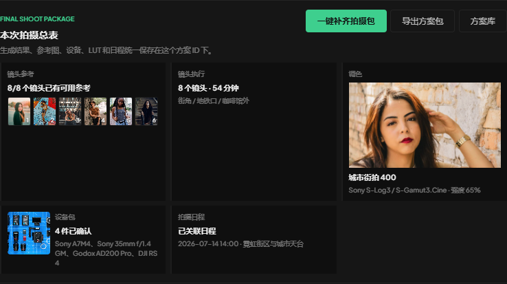

### 2. 自然光日系毕业写真

- 镜头：8
- 参考图：8，不重复 8
- LUT：t3-pro-400h
- 已选设备：4
- 日程关联：通过
- 拍摄包状态：ready

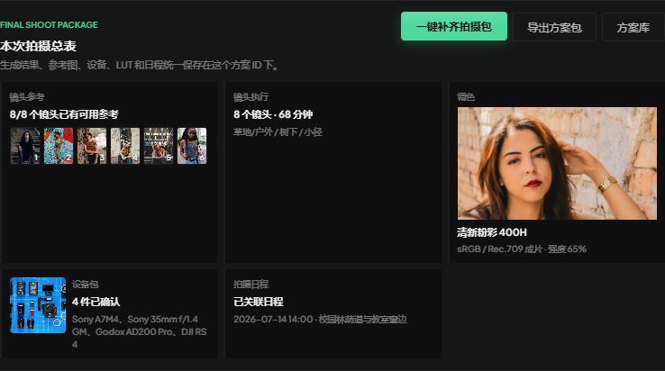

### 3. 护肤品商业棚拍

- 镜头：8
- 参考图：8，不重复 8
- LUT：t3-astia-100f
- 已选设备：3
- 日程关联：通过
- 拍摄包状态：ready

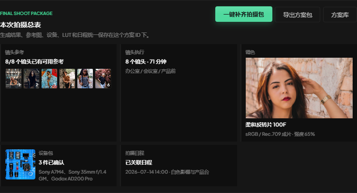

### 4. 黄昏草坪婚纱短片

- 镜头：8
- 参考图：8，不重复 8
- LUT：vlog-eterna
- 已选设备：4
- 日程关联：通过
- 拍摄包状态：ready

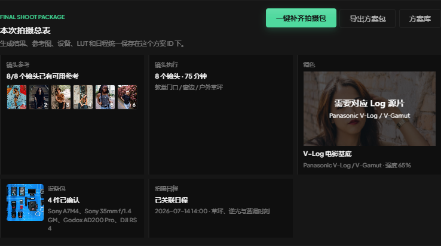

## 功能截图

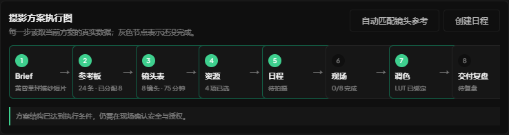

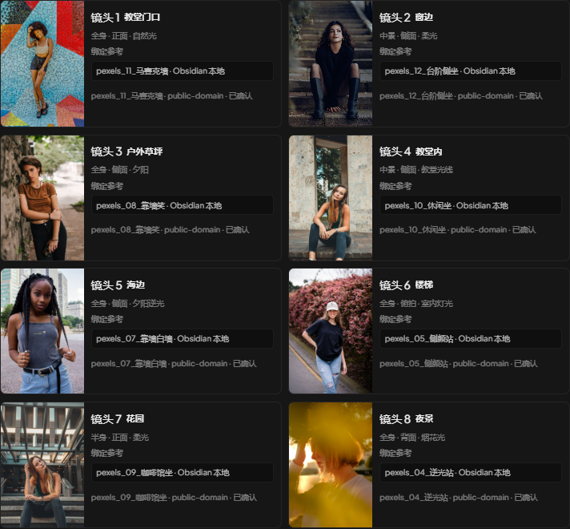

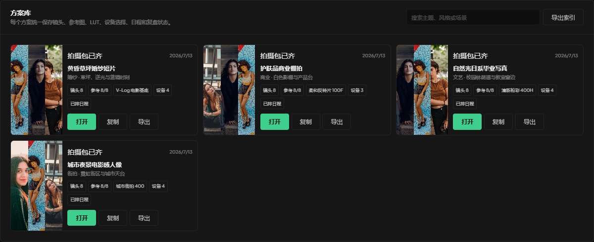

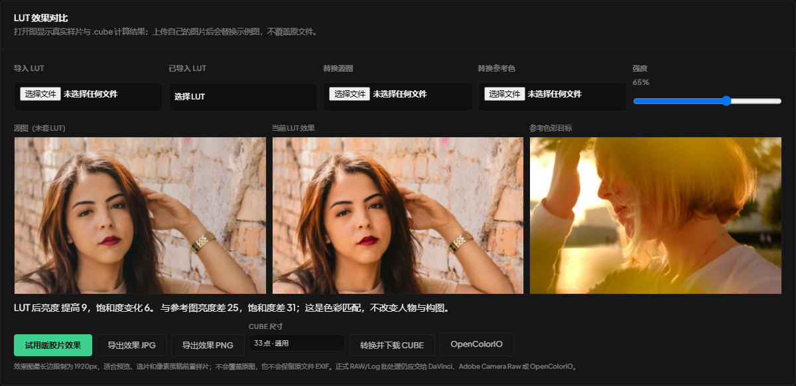

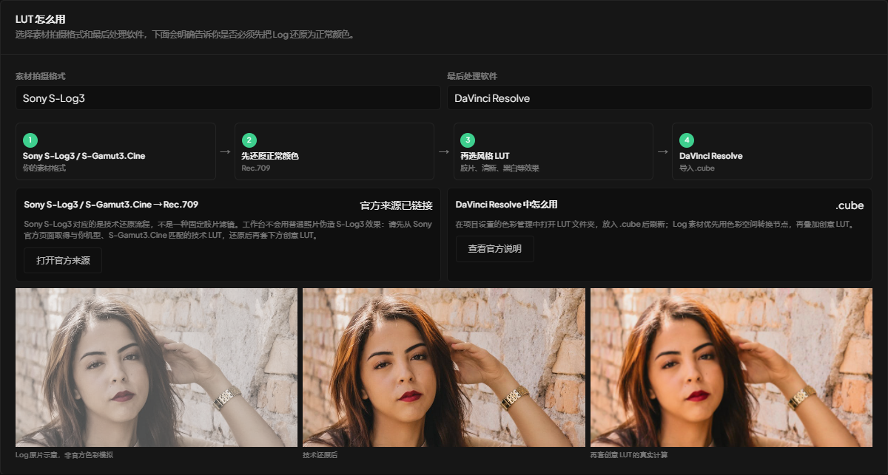

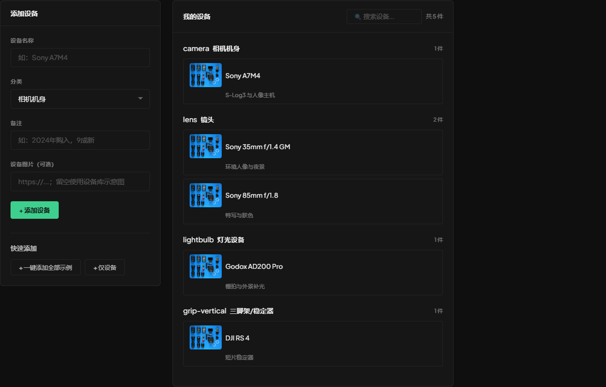

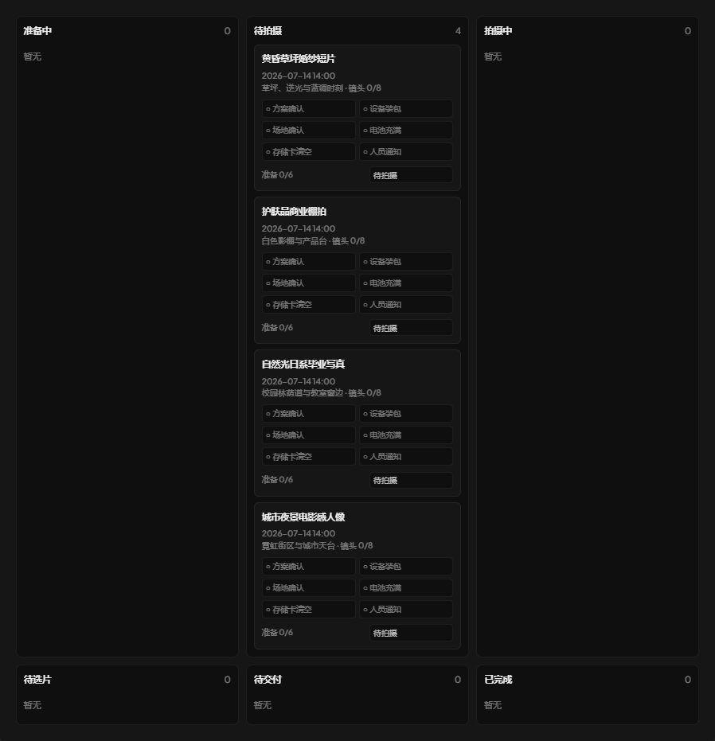

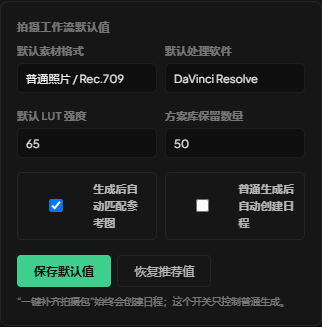

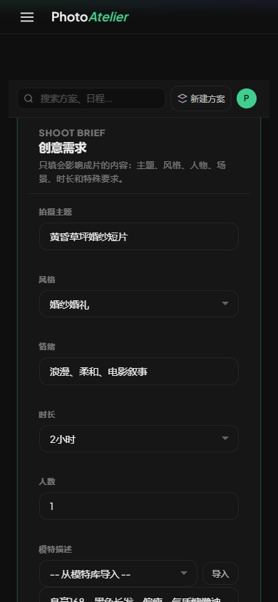
