# PhotoAtelier 通用工作流验收报告

生成时间：2026-07-14T10:52:30.593Z

这些输入只用于验证通用工作流，不代表产品内置题材模板或专项后期方案。

## 结果

### 1. 通用单人人像流程测试

- 镜头：8
- 参考图：8，不重复 8
- 后期状态：specialist-required
- 自动选择创意 LUT：否
- 已选设备：4
- 日程关联：通过
- 方案状态：scheduled
- 拍前资料状态：preflight-ready

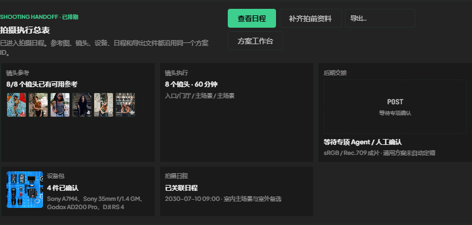

### 2. 通用双人拍摄流程测试

- 镜头：8
- 参考图：8，不重复 8
- 后期状态：specialist-required
- 自动选择创意 LUT：否
- 已选设备：4
- 日程关联：通过
- 方案状态：scheduled
- 拍前资料状态：preflight-ready

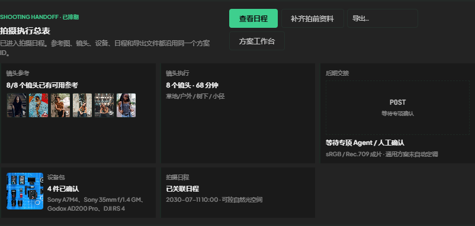

### 3. 通用产品内容流程测试

- 镜头：8
- 参考图：8，不重复 8
- 后期状态：specialist-required
- 自动选择创意 LUT：否
- 已选设备：3
- 日程关联：通过
- 方案状态：scheduled
- 拍前资料状态：preflight-ready

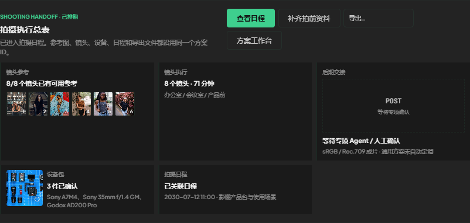

### 4. 通用短片内容流程测试

- 镜头：8
- 参考图：8，不重复 8
- 后期状态：specialist-required
- 自动选择创意 LUT：否
- 已选设备：3
- 日程关联：通过
- 方案状态：scheduled
- 拍前资料状态：preflight-ready

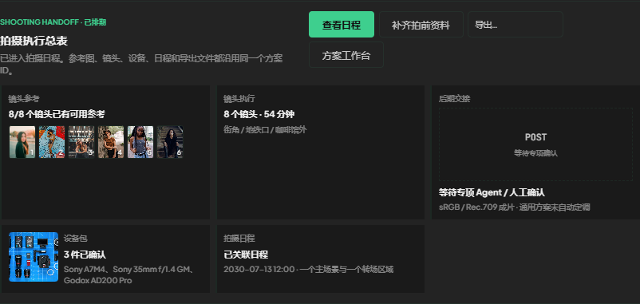

## 三段式方案状态

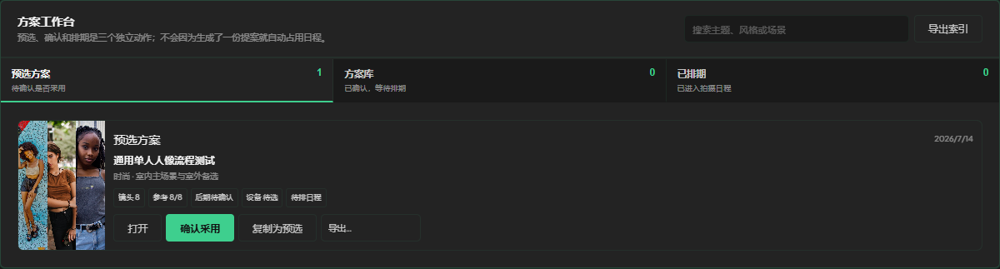

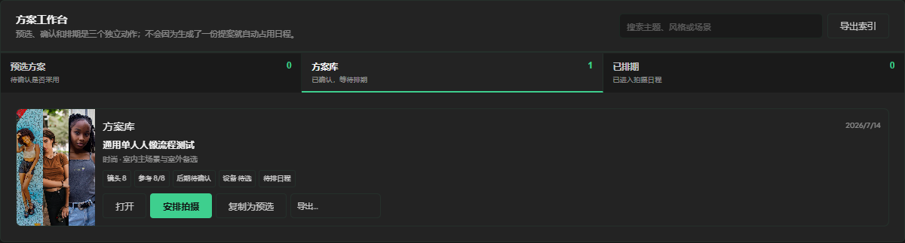

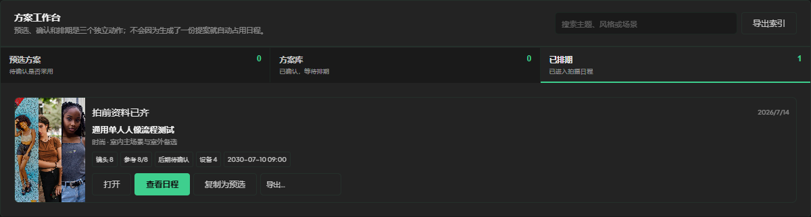

## 新交互

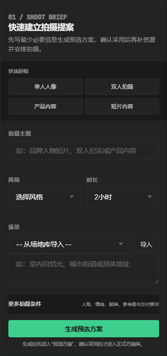

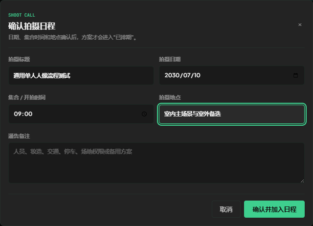

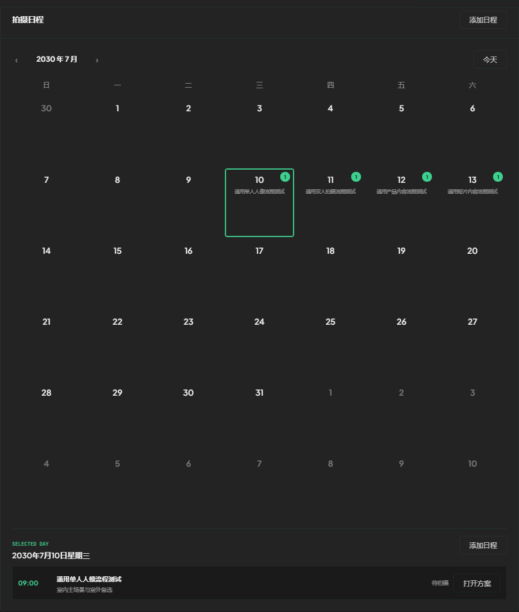

## 方案正文截图

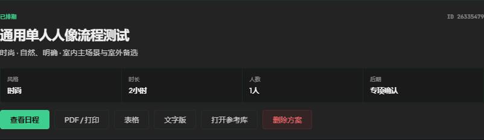

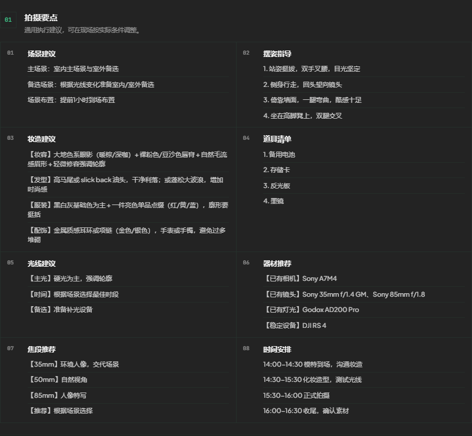

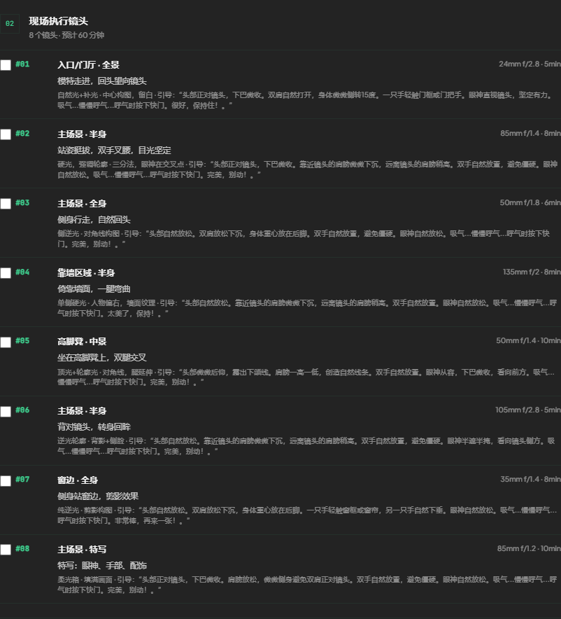

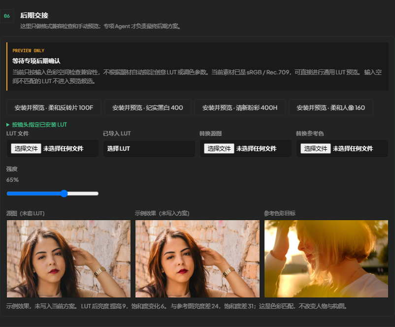

## 功能截图

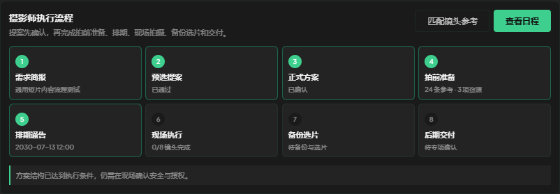

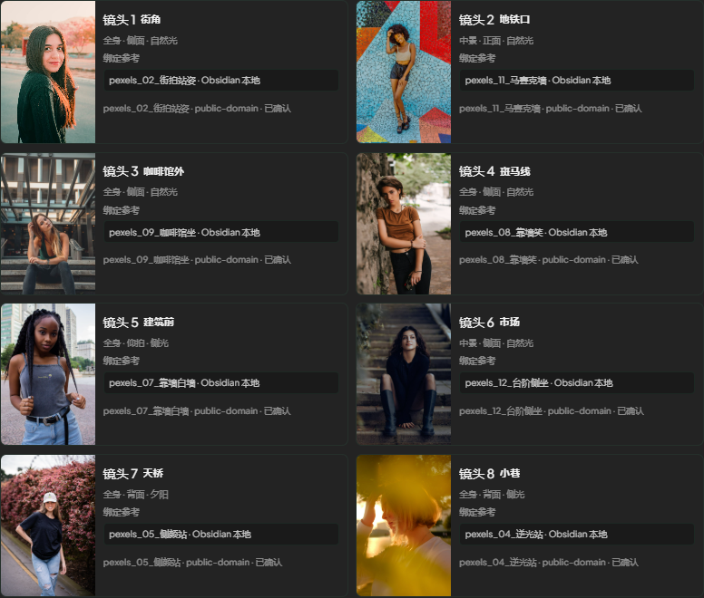

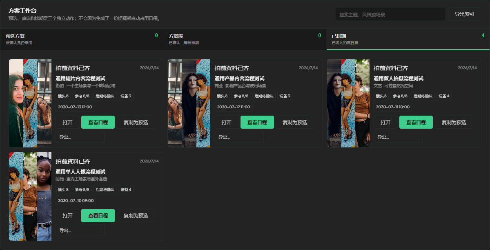

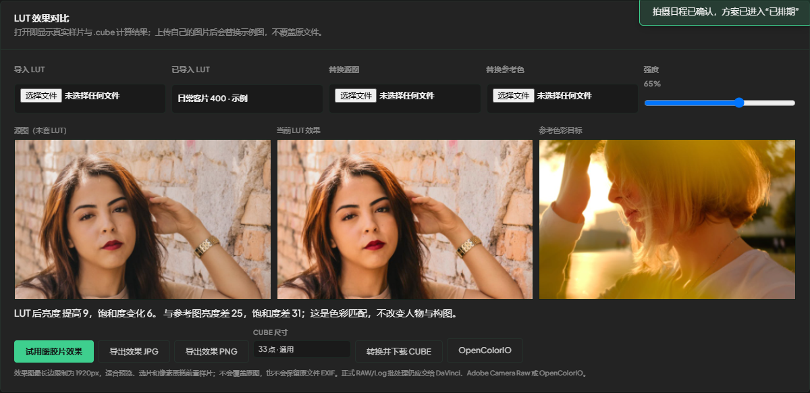

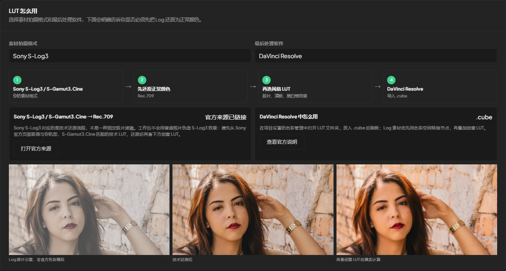

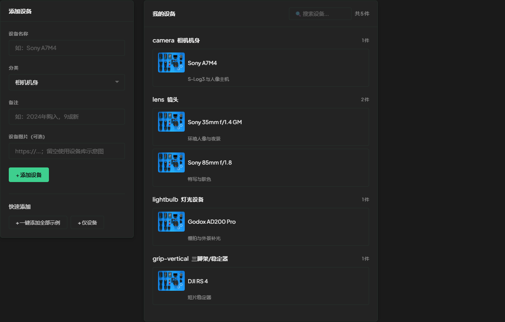

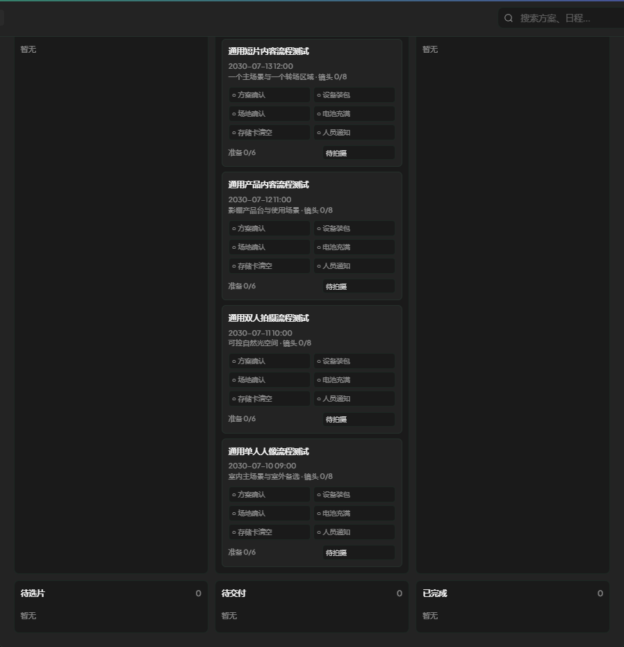

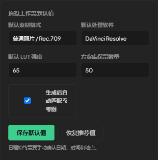

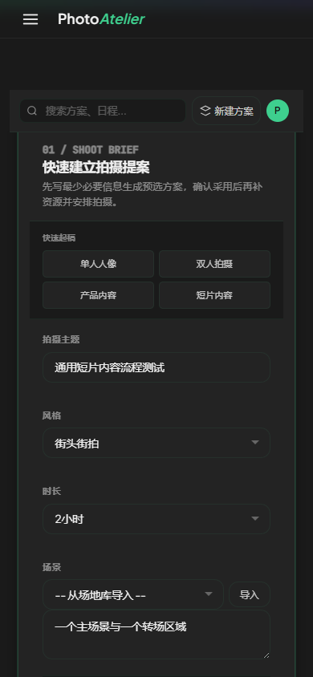
