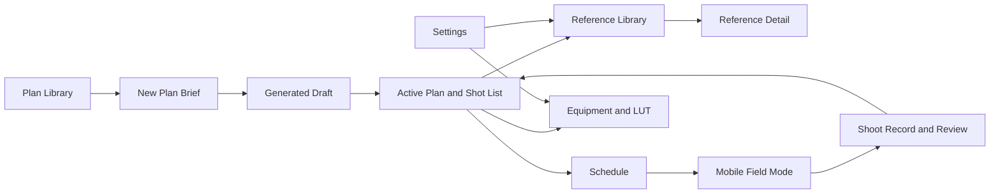

# PhotoAtelier Complete Product Screen Map

## 1. Design status

The R4 product direction now covers the complete personal photography
workbench, not only Active Plan, Reference Detail, and Mobile Field Mode.

This document extends `PRODUCT-DESIGN-FINAL-DIRECTION.md`. It does not change
the current R4-A through R4-E implementation assignments.

Newly added source visuals:

- `assets/desktop-plan-library.png`
- `assets/desktop-new-plan.png`
- `assets/desktop-schedule.png`
- `assets/desktop-equipment-lut.png`
- `assets/desktop-settings.png`
- `assets/mobile-reference-schedule.png`

Existing source visuals:

- `assets/desktop-active-plan.png`
- `assets/desktop-reference-detail.png`
- `assets/mobile-field-mode.png`

The written rules override incidental visual-generation errors, extra colors,
duplicate actions, or labels visible inside any source image.

## 2. Product map

The normal photographer journey is:

1. Open an existing plan or create one.
2. Confirm people, place, style, duration, and constraints.
3. Review and edit the complete shot list.
4. Select real references, equipment, and one LUT/color direction.
5. Put the plan on the schedule.
6. Execute one shot at a time on mobile.
7. Record notes and return useful experience to the plan and personal library.

## 3. Desktop navigation

The desktop shell always has six destinations:

1. `方案库`
2. `新建方案`
3. `参考图库`
4. `日程`
5. `设备与 LUT`
6. `设置`

Rules:

- navigation width: 216 px;
- one selected destination;
- Lucide outline icon plus concise noun;
- no notification counters unless the count represents real pending work;
- no dashboard, messages, history, quotation, backup, Agent, or integration
  destination;
- feedback remains a quiet utility action and never covers working content.

## 4. Desktop Plan Library

Source: `assets/desktop-plan-library.png`

### Purpose

The Plan Library is the normal entry. It answers:

- what am I preparing now;
- what is scheduled next;
- which plans need confirmation;
- which plan should I open.

### Layout

- header: title, plan count, one `新建方案` action;
- filter bar: lifecycle segments, search, type, date, and compact More/filter;
- dense plan list: one row per plan;
- selected-plan detail: next shoot, shot count, equipment/LUT readiness, and a
  short note.

### Plan row

Show:

- meaningful real thumbnail when available;
- title;
- lifecycle state;
- client or shooting type;
- next date/time;
- location;
- shot count;
- completion;
- More.

Do not show:

- a decorative cover when no real image exists;
- full creative rationale;
- multiple buttons in every row;
- vanity statistics.

### Empty state

`还没有拍摄方案。创建第一份方案，或从已保存的模板开始。`

Actions:

- primary: `新建方案`;
- secondary: `从模板开始`.

## 5. Desktop New Plan

Source: `assets/desktop-new-plan.png`

### Structure

New Plan is a three-step progressive brief:

1. `拍摄需求`
2. `人物与场地`
3. `确认生成`

The page is not a long form beside an empty result panel.

### Required input

- shooting task or theme;
- people/talent;
- place/venue;
- style;
- duration.

### Secondary input

Keep under one `更多拍摄条件` disclosure:

- mood;
- clothing/styling;
- selected references;
- delivery format;
- orientation;
- budget or equipment constraints;
- special restrictions.

### Summary

The compact summary may show:

- selected people and place;
- three selected real references;
- equipment preference;
- estimated shot range.

It must not pretend a final plan exists before generation.

### Commands

- primary: `生成可编辑方案`;
- secondary: `保存草稿`;
- quiet: `返回方案库`.

## 6. Desktop Active Plan

Source: `assets/desktop-active-plan.png`

The complete shot list remains the primary working region. The design contract
in `PRODUCT-DESIGN-FINAL-DIRECTION.md` remains authoritative.

The Active Plan must connect visibly to:

- selected real references;
- schedule;
- equipment and LUT;
- shoot record;
- review.

These are relations around the shot list, not unrelated panels.

## 7. Desktop Reference Library and Detail

Detail source: `assets/desktop-reference-detail.png`

### Reference Library

First level:

- actual thumbnail;
- concise title;
- explicit `实拍参考` or `概念图`;
- one useful fact;
- selection state.

Filters:

- type;
- theme;
- scene;
- framing;
- focal length;
- lighting;
- orientation;
- source/license;
- project relation.

Metadata opens in Reference Detail. It does not expand inside every grid tile.

### Reference Detail

Use:

`actual image 44% | analysis/source 26% | linked plans/shots 30%`

One primary command:

- `添加到方案`; or
- `从方案移除`.

The exact source action appears only when a concrete source exists.

## 8. Desktop Schedule

Source: `assets/desktop-schedule.png`

### Layout

- calendar or week region: approximately 70%;
- selected-date agenda: approximately 30%.

The selected date can be before or after today.

### Scheduled shoot

Show:

- plan title and meaningful thumbnail;
- meeting time;
- shooting time;
- location;
- weather and daylight when available;
- linked plan;
- shot count;
- equipment readiness;
- checklist progress;
- current lifecycle state.

Lifecycle states:

- 准备中;
- 待拍摄;
- 拍摄中;
- 待选片;
- 待交付;
- 已完成.

Do not assign a different decorative hue to every state. Use neutral states,
warning for attention, sage for active/selected, and success for complete.

Commands:

- primary: `打开拍摄方案`;
- secondary: `编辑日程`;
- remaining commands: More.

## 9. Desktop Equipment and LUT

Source: `assets/desktop-equipment-lut.png`

Use one destination with three segmented modes:

1. `设备`
2. `LUT`
3. `仿色预览`

### Equipment mode

Show reusable inventory:

- camera body;
- lens;
- lighting;
- support;
- audio/video accessories when relevant;
- availability and readiness;
- plans currently using the item.

Equipment imagery is optional and factual. Do not use decorative product
renders as category covers.

### LUT mode

Separate:

- technical transforms;
- creative looks.

Every LUT record shows:

- file/type;
- exact source and license;
- input color space;
- output color space;
- compatible cameras/log formats;
- supported applications;
- skin-tone behavior;
- ideal scenes;
- avoid conditions;
- installed state.

Compatibility must be truthful:

- DaVinci Resolve and Photoshop may import supported `.cube` files;
- Blackmagic Camera compatibility depends on accepted LUT size/format and
  device/app support;
- PixelCake receives exported image results, not a claimed direct LUT install.

### Color preview

Three views:

1. `原图`
2. `LUT 预览`
3. `参考色彩`

Use the same crop and a single intensity control. Preview never overwrites the
original image.

Commands:

- primary: `应用到当前方案`;
- secondary: `导入 .cube`;
- export belongs in More when applicable.

## 10. Desktop Settings

Source: `assets/desktop-settings.png`

Categories:

- 个人偏好;
- 我的图库;
- 素材来源;
- 数据与备份;
- 语言与外观;
- 关于.

### My Library

Use photographer language:

- PhotoAtelier;
- Reference Inbox;
- Shoot Notes;
- Reviews.

Possible states:

- 已连接;
- 尚未设置;
- 需要修复;
- 当前不可用.

Each state includes one clear next action. Do not expose `proxy`, `gateway`,
`API`, `schema`, or `localhost` in the normal UI.

Only one destructive `恢复默认设置` command exists, behind confirmation.

## 11. Mobile product map

Mobile bottom navigation:

1. `方案`
2. `参考`
3. `日程`
4. `我的`

Mobile is task-focused. It does not reproduce all desktop administration.

### Mobile Field Mode

Source: `assets/mobile-field-mode.png`

The current shot and next physical action remain first.

### Mobile Reference Selection

Source: left screen in `assets/mobile-reference-schedule.png`

Show:

- back;
- search;
- filter;
- `全部 / 实拍参考 / 概念图`;
- two-column real image grid;
- explicit asset type;
- subtle selected state;
- sticky selected count and `添加到方案`.

Hide bottom navigation while inside the modal selection flow.

### Mobile Schedule

Source: right screen in `assets/mobile-reference-schedule.png`

Show:

- selectable seven-day strip;
- chronological day agenda;
- plan thumbnail/title;
- time;
- place;
- status;
- weather/daylight;
- shot and readiness summary;
- primary `打开拍摄方案`;
- next-day collapsed event;
- bottom navigation.

## 12. Responsive transitions

### 1180 px and below

- collapse the desktop reference column into a drawer;
- keep navigation and shot workspace;
- preserve shot selection.

### 1024 px and below

- shot table becomes stacked rows;
- secondary project facts move below the shot list;
- toolbar commands move into More;
- no horizontal table scroll for the primary shot workflow.

### 767 px and below

- switch to mobile navigation and task-specific screens;
- details open as sheets;
- all touch targets are at least 44 x 44 px;
- body text is at least 17/24;
- persistent actions respect safe-area insets.

## 13. Content states

Every major screen requires:

- loading;
- empty;
- partial data;
- unavailable source;
- validation error;
- saved/success;
- offline or external-source failure when relevant.

Rules:

- retain usable local data when an external source fails;
- explain the next action in one sentence;
- never show fake data to make an empty screen look complete;
- hide actions that cannot work;
- use skeletons only when content is genuinely loading.

## 14. Implementation waves

### Current R4-A through R4-E

- foundations and controls;
- shell, Plan Library, New Plan;
- Active Plan;
- Reference Library and Detail;
- Mobile Field Mode and mobile Schedule.

Do not expand active Agent scopes while they are working.

### Next R4.1 operations wave

After current packages merge:

- desktop Schedule;
- Equipment and LUT;
- Settings;
- remaining mobile reference selection;
- content-state consistency.

These should be split into new non-overlapping work orders only after the
current baseline is integrated.

## 15. Design acceptance

- A photographer always sees the next useful task before secondary tools.
- Real photography is the visual accent; application chrome remains quiet.
- Desktop and mobile use one type, icon, color, and spacing system.
- Every visible relationship leads to a real plan, shot, reference, schedule,
  equipment item, or LUT record.
- No inactive command, generic source link, fake cover, or technical setup
  language appears in normal use.

## 16. P5 functional-QA design constraints

`QA-P5-REPORT.md` validates the pre-R4 functional baseline. It does not replace
R4 visual QA, but it adds two design constraints:

1. A plan displays exactly one current lifecycle state. If historical local
   data contains both `draft` and `confirmed`, the UI shows the state selected
   by the lifecycle precedence rule and places older state information in
   history, never beside the current badge.
2. Every page has one visible H1/page title. A section may repeat the subject
   only as a shorter H2 or contextual label; duplicate same-level headings are
   removed.

The P5 navigation labels and visible legacy relation workspace are functional
baseline evidence, not the final R4 information architecture. R4 continues to
use the six destinations and progressive disclosure defined above.
